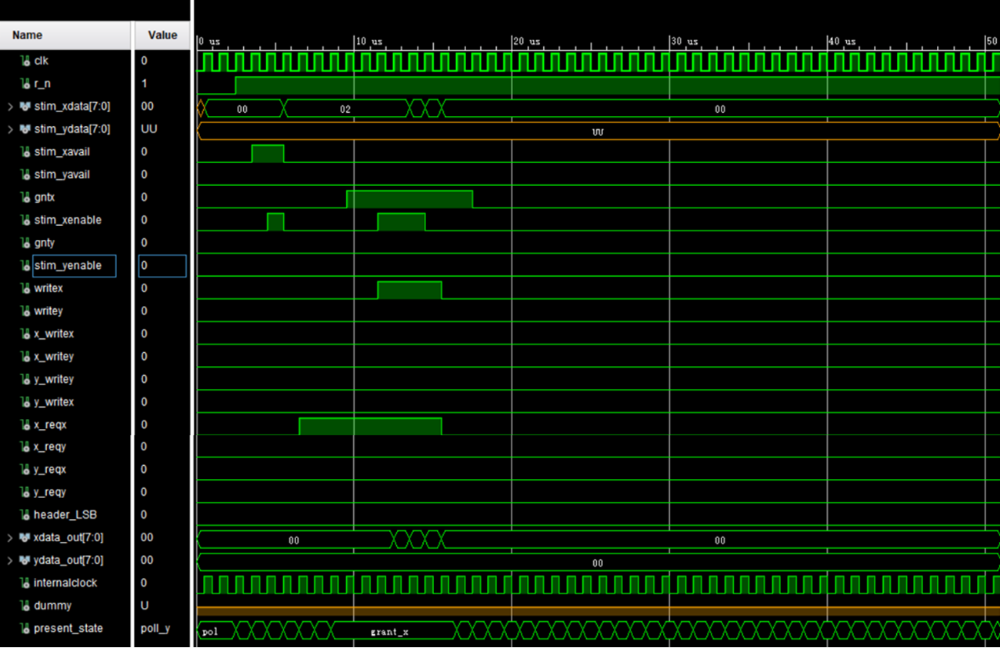

# Crossbar-Switch-System-Deisgn
This project aims at designing a data packet routing system to tackle communication between different modules in a common bus, specifically, use VHDL code to implement circuit diagram as following:

A simple simulation result: (more see in "Simulation_Results")

The code is implemented in VHDL, a common CAD tool (Vivado etc.) could run this code.
